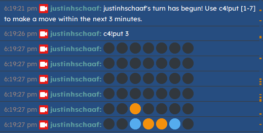
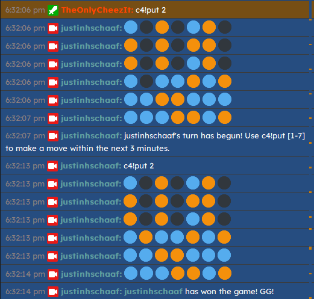
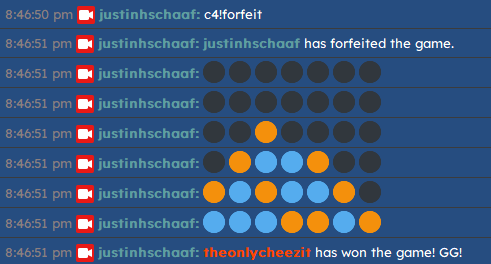

# TwitchC4

*Play Connect 4 in Twitch chat*

This is a Twitch chat bot for having Connect 4 games between users. I originally
developed it around May 2021 as a fan-made project for a streamer because their
chat wanted to play Connect 4 in Twitch chat. As I never received any response
(and for other factors), I've decided to post the source for this now.

## Donate

If you like what I do, please consider supporting me on Liberapay.

[](https://liberapay.com/justinhschaaf)

## How To Play

*Note that the bot user is set to send messages through my account in these 
screenshots for demo purposes. However, it shouldn't be too difficult to tell
which are from the bot.*

When you want to play a game of Connect 4, you can challenge any user to play 
with the `c4!play` command. Any user who uses the same command will accept the 
challenge, and a new game of Connect 4 will begin.


You can also directly challenge a player to a game by using `c4!play [to]`,
which the recipient can accept with `c4!play [from]`


To make a move in the game, simply use the `c4!put [1-7]` command with the
column you wish to play a piece in as the only argument.



Over time, the board will fill up and one of the players will win the game.



Note that this is not the only conclusion to a game. If the entire top row is
filled with no winner, the game will simply end in a tie. Either player can also
forfeit the game at any time using the "c4!forfeit" command (which is also used
to cancel and decline challenges).



*(Thanks to @TheOnlyCheezIt for helping me test this back when I made it)*

## Setup

To run the bot, download the latest JAR file from the "Releases" tab and run it
in your console of choice using `java -jar TwitchC4-1.0.jar`. Make sure you have
[downloaded and installed Java 11 or later](https://adoptium.net/index.html?variant=openjdk11&jvmVariant=hotspot)
to run the program.

## Config

On first run, a configuration file will be generated which has options to 
configure the login credentials for Twitch; see below for the default config
file, which should sufficiently explain the default values and what each option
does.

The config follows [HOCON](https://github.com/lightbend/config/blob/master/HOCON.md)
format which is parsed using [NightConfig](https://github.com/TheElectronWill/Night-Config).

### Default Config

```hocon
#
# ### #   # ### ### ### # #    ### # #
#  #  # # #  #   #  #   ###    #   ###
#  #   # #  ###  #  ### # #    ###   #
#
# Play Connect 4 in Twitch chat
# Developed by Justin Schaaf (https://justinschaaf.com)
#
# This file is in HOCON format. For the full spec, see https://github.com/lightbend/config/blob/master/HOCON.md
# (you shouldn't need it though, it's quite self explanatory)
#

# Allows the bot to properly authenticate
# See https://yamltobot.com/wiki/twitch/Creating-a-Bot-User for a proper tutorial
# (it's slightly outdated, but should work just fine and gives you an idea of what to look for)
oauth: ""
id: ""
secret: ""

# The list of channels to connect to
channels: ["justinhschaaf"]

commands: {

    # Command prefix
    # Default: "c4!"
    prefix: "c4!"

    # Enables a command which states the developer of the bot (c4!about)
    # Default: true
    author-attribution: true

    # Allows mods to override whether or not the game can be played with c4!toggle
    # Default: true
    mod-toggle: true

}

game: {

    # How long each turn takes, in seconds
    # Default: 180, Min: 15
    timer: 180

    # Symbols to represent a cell's state
    symbols: {

        # Default: https://unicode-table.com/en/26AB/
        empty: "⚫"

        # Default: https://unicode-table.com/en/1F7E0/
        p1: "🟠"

        # Default: https://unicode-table.com/en/1F535/
        p2: "🔵"

    }

    # Whether or not Connect 4 can be played while online and offline
    while-online: false # Default: False
    while-offline: true # Default: True

    # Defines the dimensions of the game board
    # Default: 7x6, Min: 1, Max: 500
    board-width: 7
    board-height: 6

    # Allows multiple games to be played at once in a single channel
    # Default: True
    concurrent: true

    # Whether or not a random player is selected to have the first turn instead of the challenger
    # Default: True
    random-start: true

}

localisation: {

    # String Replacements Key:
    # %p% is the generic user the message is concerned with
    # %f% is the user which sent a challenge
    # %t% is the user a challenge was sent to
    # %p1% is the first player in the game (usually the challenger)
    # %p2% is the second player in the game

    help: """
        Use c4!play [user] to challenge a user to a game, or don't specify a user to challenge anyone!
        Use c4!put [1-7] to make a move in a game.
        Use c4!forfeit to forfeit a game, to cancel a challenge, or to decline a challenge.
        """

    # %p1% %p2%
    game-start: "The game between %p1% and %p2% has begun!"

    # %p%
    game-turn-start: "%p%'s turn has begun! Use c4!put [1-7] to make a move within the next 3 minutes."

    # %p1% %p2%
    game-tie: "No player has won the game, sorry!"

    # %p%
    game-win: "%p% has won the game! GG!"

    # %f%
    challenge-send: "%f% has challenged any user to a game! Use c4!play or c4!play %f% to play!"

    # %f% %t%
    challenge-send-to: "%f% has challenged %t% to a game! Use c4!play %f% to accept!"

    # %f%
    challenge-expire: "The Connect 4 challenge from %f% has expired."

    # %p%
    forfeit: "%p% has forfeited the game."

    # %f%
    forfeit-sent-challenge: "Successfully cancelled your challenge."

    # %f% %t%
    forfeit-decline-challenge: "Sorry, %f%, but %t% declined your challenge."

    # %p%
    toggle-enable: "New Connect 4 games enabled!"

    # %p%
    toggle-disable: "New Connect 4 games disabled!"

    # %f%
    shutdown-cancel-challenge: "Sorry, %f%, but your challenge was cancelled because the bot shut down."

    # %p1% %p2%
    shutdown-cancel-game: "Sorry, %p1% and %p2%, but your game was cut short because the bot shut down."

    error-generic: "Uh oh! Something went wrong."

    # %p%
    error-unknown-command: "Unknown command. Use c4!help for how to use the bot."

    # %p%
    error-already-ingame: "You can't be in two games at once, %p%!"

    # %f% %t%
    error-other-ingame: "Sorry, %f%, but %t% is already in a game!"

    # %p%
    error-not-ingame: "You are currently not in a game!"

    # %p%
    error-not-turn: "Please wait for your turn!"

    # %p%
    error-no-column: "Please specify a column from 1 to 7."

    # %p%
    error-invalid-column: "You can't play there! Please try again."

    # %p%
    error-already-challenging: "You already have an outgoing challenge!"

    # Used when game.concurrent is false
    # %p%
    error-already-ongoing: "Only one game can be played at a time!"

}
```
